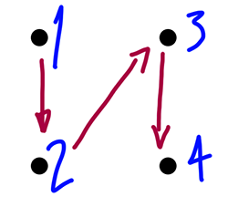
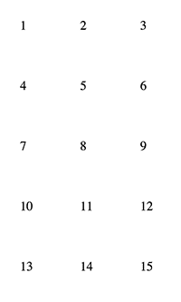

# d3-iconarray

Draw an array of icons!

There are two parts to this plugin. First a layout function which will assign x,y coordinates to elemetns of an array given some parameters. Second a scale which will put regular breaks in the array of icons to aid legibility.

## Installing

If you use NPM, `npm install d3-iconarray`. Otherwise, download the [latest release](https://github.com/tomgp/d3-icon-array/releases/latest).

## API Reference

<a href="#layout" name="layout">#</a> d3_iconarray<b>.layout</b>()

Construct a new icon array layout function when given an array of data th function will return an array containing grid positions as well as the original data.

example

```
var layout = d3_iconarray.layout();

var grid = layout([1,2,3,4]); 

/*
'grid' is

[
	{"data":1,"position":{"x":0,"y":0}},
	{"data":2,"position":{"x":1,"y":0}},
	{"data":3,"position":{"x":0,"y":1}},
	{"data":4,"position":{"x":1,"y":1}}
]

/*

```
You can use the resulting grid to plot icons, the data points will be arranged like this


TODO: block

<a href="#widthFirst" name="widthFirst">#</a> layout<b>.widthFirst</b>([boolean])

This function sets the order in which points are arranged in the grid. if widthFirst is set to true rows will be filled before starting the next, if it's false columns in the layout will be filled first

example
```
var layout = d3_iconarray.layout()
					.widthFirst(true);

var grid = layout([1,2,3,4]); 
```

the resulting in the resulting grid the icons will be arranged like this


with ` .widthFirst(false)` they'll be arranged like this



<a href="#width" name="width">#</a> layout<b>.width</b>([integer])

the width function defines the maximum number of elements the grid will have in a given row

example

```
var layout = d3_iconarray.layout().width(3);
var grid = layout([1,2,3,4,5,6,7,8,9,10,11,12,13,14,15]);
```
results in a grid like



TODO: block

<a href="#height" name="height">#</a> layout<b>.height</b>([integer])

the height function defines the maximum number of eements the grid will have in a given row

example
```
var layout = d3_iconarray.layout().height(3);
var grid = layout([1,2,3,4,5,6,7,8,9,10,11,12,13,14,15]);
```

results in a grid like

